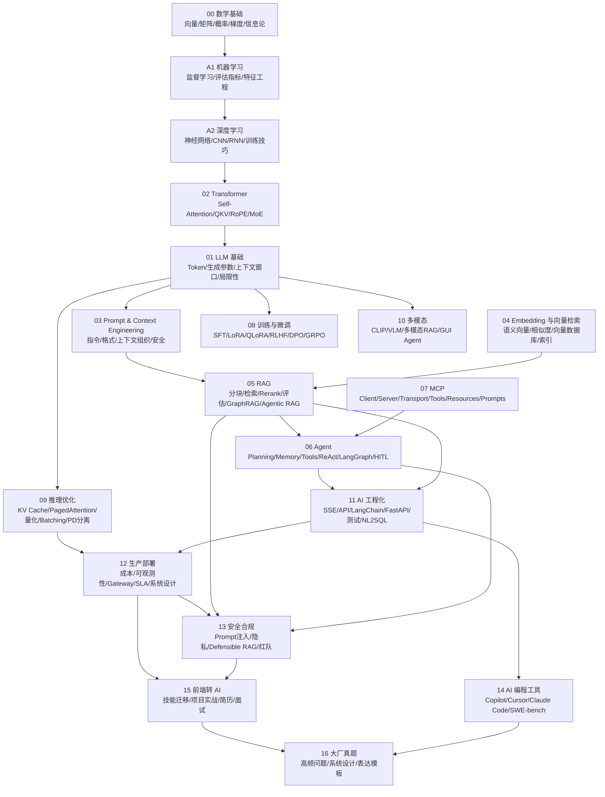
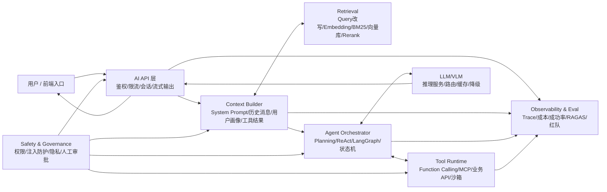

# AI Guide 总体知识架构图

> 用一张总图把 `ai-guide` 从“章节列表”变成“系统地图”。

这套资料可以按一个完整 AI 应用系统来理解，而不是按文件顺序硬背：

1. 模型为什么能生成答案：数学、机器学习、深度学习、Transformer、LLM。
2. 怎么让模型拿到正确上下文：Prompt、Embedding、RAG、Context Engineering。
3. 怎么让模型执行任务：Function Calling、Agent、MCP、工具系统、工作流。
4. 怎么让系统可上线：推理优化、工程化、生产运维、评测、安全。
5. 怎么转化成你的竞争力：前端转 AI、AI Coding、面试题。

## 1. 全景架构



### 1.1 箭头怎么读

这张图里的箭头不是“代码调用关系”，而是“学习和理解上的依赖关系”：

```text
A --> B
```

表示：理解 B 时，A 是重要前置知识，或者 A 会在真实 AI 系统里支撑 B。

可以把边分成三类：

| 边类型 | 含义 | 例子 |
|---|---|---|
| 前置知识边 | 先理解左边，右边才容易讲清楚 | `数学基础 -> 机器学习 -> 深度学习 -> Transformer -> LLM` |
| 能力输入边 | 左边是一种能力，右边会用到它 | `Embedding -> RAG`、`MCP -> Agent` |
| 工程落地边 | 左边做出来之后，右边负责让它上线、可控、可评估 | `RAG -> 工程化`、`工程化 -> 生产部署`、`Agent -> 安全合规` |

### 1.2 每条边的具体意思

| 边 | 人话解释 |
|---|---|
| `00 数学基础 -> A1 机器学习` | 机器学习里的向量、概率、损失函数、梯度下降，都来自数学基础。 |
| `A1 机器学习 -> A2 深度学习` | 深度学习是机器学习的一支，只是把“手写特征”变成了“神经网络自动学特征”。 |
| `A2 深度学习 -> 02 Transformer` | Transformer 是深度学习里的神经网络架构，理解神经网络和序列模型后更好理解它为什么出现。 |
| `02 Transformer -> 01 LLM 基础` | 现代 LLM 大多基于 Transformer，Token、上下文窗口、Next Token Prediction 都建立在这个架构上。 |
| `01 LLM 基础 -> 03 Prompt & Context Engineering` | Prompt 本质是在控制 LLM 的输入；理解 Token、上下文窗口、生成参数后，才知道怎么组织输入。 |
| `01 LLM 基础 -> 08 训练与微调` | 微调是在已有 LLM 基座上改变模型行为，所以要先知道 LLM 是什么。 |
| `01 LLM 基础 -> 09 推理优化` | KV Cache、量化、Batching 都是在优化 LLM 推理过程。 |
| `01 LLM 基础 -> 10 多模态` | 多模态模型通常是在 LLM 上接入视觉/音频等模态，把非文本信号对齐到 LLM 能处理的空间。 |
| `03 Prompt & Context Engineering -> 05 RAG` | RAG 最终要把检索结果组织进 Prompt/Context，检索到不等于模型就能答好。 |
| `04 Embedding 与向量检索 -> 05 RAG` | RAG 的核心检索能力依赖 Embedding、相似度计算、向量数据库和索引。 |
| `05 RAG -> 06 Agent` | Agent 经常需要检索外部知识，RAG 可以作为 Agent 的知识工具或记忆系统。 |
| `07 MCP -> 06 Agent` | Agent 要调用外部工具，MCP 提供一种标准化工具接入协议。 |
| `06 Agent -> 11 AI 工程化` | Agent 有多轮循环、工具调用、状态管理，落地时要工程化处理接口、状态、测试和异常。 |
| `05 RAG -> 11 AI 工程化` | RAG 从 Demo 到生产，需要文档更新、检索评估、缓存、权限过滤和接口封装。 |
| `09 推理优化 -> 12 生产部署` | 生产系统关心成本、延迟、吞吐，推理优化直接影响这些指标。 |
| `11 AI 工程化 -> 12 生产部署` | 有了 API、流式输出、测试、状态管理，才能进入部署、监控、SLA、系统设计。 |
| `12 生产部署 -> 13 安全合规` | 上线后会面对真实用户、真实数据和真实风险，所以需要安全、隐私、红队、审计。 |
| `05 RAG -> 13 安全合规` | RAG 有知识泄露、权限穿透、错误引用、幻觉等风险，需要安全设计。 |
| `06 Agent -> 13 安全合规` | Agent 会执行工具和写操作，更需要权限控制、人工审批、死循环防护和审计。 |
| `11 AI 工程化 -> 14 AI 编程工具` | AI Coding 本质也是 AI 工程化场景：上下文收集、工具调用、自动测试、代码评估。 |
| `12 生产部署 -> 15 前端转 AI` | 前端转 AI 不能只会调 API，还要能讲生产系统、性能、成本和可观测性。 |
| `13 安全合规 -> 15 前端转 AI` | 真正的 AI 应用工程师要知道 Prompt 注入、权限、隐私和安全边界。 |
| `15 前端转 AI -> 16 大厂真题` | 第 15 章把知识转成项目表达，第 16 章用面试题检验表达是否成体系。 |
| `14 AI 编程工具 -> 16 大厂真题` | AI Coding 是 2026 面试常见加分项，也能帮助你讲 Agent/Copilot 的真实工程经验。 |

### 1.3 最简单的读图方式

先不要一口气看所有箭头，可以按三条线读：

```text
原理线：00 -> A1 -> A2 -> 02 -> 01
应用线：01 -> 03 + 04 -> 05 -> 06 + 07
生产线：05 + 06 + 09 + 11 -> 12 -> 13 -> 15 -> 16
```

也就是说，`RAG` 和 `Agent` 是中间的主战场；前面是在回答“为什么能工作”，后面是在回答“怎么上线和怎么讲成项目”。

## 2. 一条主线

如果只记一条主线，就记这个：

```text
基础原理
  -> LLM 如何工作
  -> 如何组织上下文
  -> 如何检索外部知识
  -> 如何调用工具完成任务
  -> 如何上线、观测、控成本、控风险
  -> 如何讲成项目经验和面试答案
```

对应章节：

```text
00 / A1 / A2 / 02 / 01
  -> 03 / 04 / 05
  -> 06 / 07
  -> 09 / 11 / 12 / 13
  -> 14 / 15 / 16
```

## 3. 一个完整 AI 应用的系统图

这张图更贴近真实项目。你可以把它当成分析任何 Agent / RAG 项目的模板。



章节映射：

| 系统模块               | 重点知识                                   | 对应章节                                                    |
| ------------------ | -------------------------------------- | ------------------------------------------------------- |
| 用户入口 / 前端交互        | SSE vs WebSocket、流式渲染、对话状态             | `11-ai-engineering.md`、`15-frontend-to-ai.md`           |
| API / Gateway      | 鉴权、限流、模型路由、成本控制、降级                     | `11-ai-engineering.md`、`12-production.md`               |
| Context Builder    | System Prompt、上下文工程、历史压缩、结构化输出         | `03-prompt-engineering.md`                              |
| Retrieval          | Embedding、分块、混合检索、Rerank、RAG 评估        | `04-embedding-and-vector.md`、`05-rag.md`                |
| Agent Orchestrator | ReAct、Planning、Memory、LangGraph、死循环防护  | `06-ai-agent.md`                                        |
| Tool Runtime       | Function Calling、MCP、工具协议、权限边界         | `06-ai-agent.md`、`07-mcp.md`                            |
| Model Runtime      | Token、上下文窗口、KV Cache、量化、Batching       | `01-llm-fundamentals.md`、`09-inference-optimization.md` |
| 训练与模型能力            | SFT、LoRA、QLoRA、RLHF、DPO、多模态            | `08-model-training.md`、`10-multimodal.md`               |
| 评测与观测              | RAGAS、LLM-as-Judge、Trace、SLA、Benchmark | `05-rag.md`、`06-ai-agent.md`、`12-production.md`         |
| 安全与合规              | Prompt 注入、权限隔离、Defensible RAG、红队       | `13-ai-safety.md`                                       |

## 4. 章节分层

| 层级      | 解决的问题                  | 章节                       | 学习要求                           |
| ------- | ---------------------- | ------------------------ | ------------------------------ |
| L0 基础直觉 | AI 背后的数学与历史演进          | `00`、`A1`、`A2`           | 能讲直觉，不追公式推导                    |
| L1 模型内核 | LLM 为什么能理解和生成文本        | `01`、`02`                | 能讲 Token、Attention、Q/K/V、上下文窗口 |
| L2 能力增强 | 怎么改变模型能力、速度和输入模态       | `08`、`09`、`10`           | 能做选型：微调、RAG、推理优化、多模态           |
| L3 应用架构 | 怎么搭 RAG / Agent / 工具系统 | `03`、`04`、`05`、`06`、`07` | 重点掌握，面试和项目最常考                  |
| L4 工程生产 | 怎么上线、监控、评估、控成本、控风险     | `11`、`12`、`13`           | 能讲生产问题和防护方案                    |
| L5 职业落地 | 怎么变成前端转 AI 的项目表达       | `14`、`15`、`16`           | 能把知识讲成项目、简历和面试答案               |

## 5. 学习路线

### 第一阶段：建立模型直觉

目标：知道 LLM 是什么，不再把所有概念混在一起。

阅读顺序：

```text
00 数学基础
-> A1 机器学习
-> A2 深度学习
-> 02 Transformer
-> 01 LLM 基础
```

必须能回答：

| 问题 | 关联知识 |
|---|---|
| Transformer 为什么取代 RNN？ | 并行计算、长距离依赖、Self-Attention |
| Q/K/V 到底是什么？ | Query 查什么、Key 被查什么、Value 提供内容 |
| LLM 为什么会幻觉？ | Next Token Prediction、概率生成、缺少事实校验 |
| Context Window 是什么限制？ | 输入预算、长上下文退化、Lost in the Middle |

### 第二阶段：掌握 AI 应用主战场

目标：能设计一个企业知识库 RAG 或业务 Agent。

阅读顺序：

```text
03 Prompt Engineering
-> 04 Embedding 与向量检索
-> 05 RAG
-> 06 Agent
-> 07 MCP
-> 11 AI 工程化
```

必须能回答：

| 问题 | 关联知识 |
|---|---|
| Prompt Engineering 和 Context Engineering 有什么区别？ | 只写指令 vs 组织整个上下文 |
| RAG 完整链路是什么？ | Indexing、Query、Rerank、Generate、Evaluate |
| Rerank 为什么有用？ | BiEncoder 粗召回，CrossEncoder 精排 |
| Agent 和普通 LLM 调用的本质区别？ | 规划、工具、记忆、循环执行 |
| MCP 和 Function Calling 区别？ | 协议生态 vs 单次工具调用 schema |

### 第三阶段：补生产能力

目标：能解释为什么 Demo 到生产之间差很远。

阅读顺序：

```text
09 推理优化
-> 12 生产部署
-> 13 安全合规
-> 08 模型训练与微调
-> 10 多模态
```

必须能回答：

| 问题 | 关联知识 |
|---|---|
| KV Cache 为什么能加速推理？ | 自回归解码、避免重复计算历史 token |
| PagedAttention 解决什么问题？ | KV Cache 内存碎片和批处理吞吐 |
| API 成本怎么降？ | 模型路由、缓存、Batch、Prompt Caching、压缩 |
| RAG 怎么防幻觉？ | 引用证据、拒答、Faithfulness 评估、Defensible RAG |
| 什么时候选微调而不是 RAG？ | 知识更新频率、输出风格、私有知识、成本 |

### 第四阶段：转成面试表达

目标：把知识点讲成“我能做项目”的能力。

阅读顺序：

```text
15 前端转 AI
-> 14 AI 编程工具
-> 16 大厂真题
-> quiz-review.md
```

必须能输出：

| 输出物 | 标准 |
|---|---|
| 一个 RAG 项目介绍 | 能讲清数据、检索、评估、权限、成本 |
| 一个 Agent 项目介绍 | 能讲清状态机、工具、记忆、失败处理、人工审批 |
| 一个生产问题复盘 | 能讲清现象、根因、指标、修复、长期机制 |
| 一个前端转 AI 的能力迁移 | 能把组件、状态、接口、工程化映射到 AI 系统 |

## 6. 概念关系速查

| 概念 | 它是什么 | 依赖什么 | 通向哪里 |
|---|---|---|---|
| Token | LLM 处理文本的最小单位 | Tokenizer | 计费、上下文窗口、流式输出 |
| Embedding | 文本/图片的语义向量 | 向量空间、相似度 | 向量检索、RAG、Memory |
| Prompt | 给模型的任务说明 | LLM 基础 | 结构化输出、工具调用、安全 |
| Context Engineering | 组织上下文窗口的工程方法 | Prompt、RAG、Memory | 高质量 AI 应用 |
| RAG | 用外部知识增强生成 | Embedding、向量库、Prompt | 企业知识库、客服、搜索问答 |
| Rerank | 对召回结果二次精排 | BiEncoder、CrossEncoder | 提高上下文质量 |
| Agent | 能规划并调用工具的 LLM 系统 | Prompt、Tool、Memory | 自动化任务、业务助手 |
| MCP | AI 工具接入协议 | Tool Calling、JSON-RPC | 可复用工具生态 |
| KV Cache | 缓存历史 token 的 K/V 张量 | Transformer Attention | 推理加速 |
| PagedAttention | 分页管理 KV Cache | KV Cache、虚拟内存思想 | 更高吞吐、更少碎片 |
| LoRA | 低成本参数高效微调 | 矩阵分解、SFT | 领域风格/任务适配 |
| DPO | 直接偏好优化 | 对齐数据、偏好样本 | 模型对齐 |
| LangGraph | 状态机式 Agent 工作流 | Agent、状态、条件边 | 可控循环、可观测执行 |
| Defensible RAG | 可审计、可解释、可拒答的 RAG | RAG、评测、安全 | 生产合规 |

## 7. 面试优先级

如果时间有限，优先级这样排：

| 优先级 | 知识点 | 原因 |
|---|---|---|
| P0 | RAG 全链路、Rerank、RAG 评估、权限隔离 | 最常见 AI 应用场景 |
| P0 | Agent 四组件、ReAct、工具调用、死循环防护、HITL | Agent 项目必考 |
| P0 | Prompt vs Context Engineering、结构化输出、Prompt 注入 | 应用质量和安全的基础 |
| P1 | Embedding、向量数据库、索引、相似度 | RAG 的底层能力 |
| P1 | SSE、LLM API、LangChain/LangGraph、测试 | 前端转 AI 的工程优势 |
| P1 | KV Cache、PagedAttention、量化、Batching | 能体现系统性能理解 |
| P2 | LoRA、QLoRA、RLHF、DPO | 常考但不一定需要实操 |
| P2 | 多模态 RAG、GUI Agent、AI Coding | 加分项 |
| P3 | 数学、传统 ML、CNN/RNN | 补底层直觉，面试一般浅问 |

## 8. 学习时的固定提问模板

学任何一个知识点时，都按这 6 个问题拆：

```text
1. 它解决什么问题？
2. 它在完整 AI 系统中的位置在哪里？
3. 它的输入、处理过程、输出分别是什么？
4. 它和相邻概念有什么区别？
5. 它在生产环境会出什么问题？
6. 它如何评估效果，如何优化？
```

例子：学 Rerank 时不要只背“重排序”，而是这样串：

```text
问题：粗召回 chunk 多、杂、不够准
位置：RAG Query 阶段，初召回之后，组装上下文之前
输入：query + candidate chunks
过程：CrossEncoder 对 query-chunk pair 打分
输出：Top-K 高相关 chunk
区别：BiEncoder 快、可预计算；CrossEncoder 慢、不可预计算但更准
生产问题：成本、延迟、长 chunk 截断、多语言效果
评估：Context Precision、Answer Faithfulness、端到端答案质量
```

## 9. 最小闭环学习项目

为了让知识不散，可以把所有章节都落到同一个项目闭环里：

```text
企业知识库 Agent

前端：Chat UI + SSE 流式输出
后端：LLM API Gateway + 会话管理
知识库：文档解析 + Chunking + Embedding + Vector DB
检索：Hybrid Search + Rerank + Context Compression
生成：System Prompt + Structured Output + 引用来源
Agent：ReAct/LangGraph + Search Tool + Business API Tool
安全：权限过滤 + Prompt 注入防护 + 拒答
生产：Trace + RAGAS + 成本监控 + 缓存 + 降级
```

对应章节：

```text
03 + 04 + 05 + 06 + 07 + 09 + 11 + 12 + 13 + 15
```

这个项目能把大部分知识点串起来，也最适合作为前端转 AI 的主线项目。
